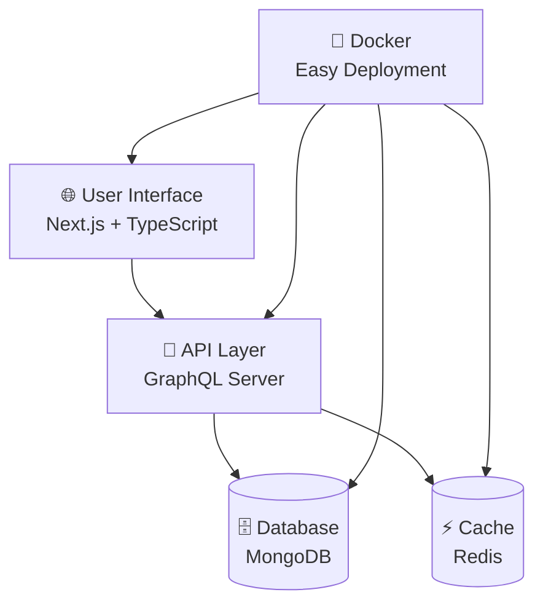

# 🎶 NexTune — Your Complete Music Catalog Manager

<div align="center">


**A powerful, modern web application for managing and discovering music metadata**  
*Built with cutting-edge technologies to showcase full-stack development expertise*

[🚀 Quick Start](#-quick-start) • [💻 Live Demo](#-live-demo) • [📖 Documentation](#-api-documentation) • [🛠️ Tech Stack](#-what-makes-this-special)

</div>

---

## ✨ What is NexTune?

NexTune is your one-stop solution for organizing and exploring music collections. Think of it as a **digital music library manager** where you can:

- 🎤 **Manage Artists** — Track bands, solo artists, formation dates, and band members
- 💿 **Organize Albums** — Catalog releases with genres, dates, and track listings  
- 🎵 **Browse Songs** — Individual track management with duration and album connections
- 🏢 **Record Labels** — Keep tabs on record companies and their artist rosters

**Perfect for:** Music enthusiasts, record collectors, music industry professionals, or anyone who loves organized data!

---

## 🌟 Why This Project Stands Out

> **For Recruiters & Technical Evaluators**

This project demonstrates **real-world software development skills** that translate directly to professional environments:

### 🎯 **Technical Excellence**
- **Modern Stack Mastery** — Latest Next.js 15, TypeScript, and GraphQL technologies
- **Database Expertise** — MongoDB for data persistence + Redis for lightning-fast caching
- **Production-Ready Code** — Type-safe development, error handling, and clean architecture
- **DevOps Skills** — Docker containerization and deployment-ready configuration

### 🚀 **Professional Development Practices**
- **API-First Design** — GraphQL schema with comprehensive CRUD operations
- **Responsive UI/UX** — Mobile-first design built with Tailwind CSS
- **Code Quality** — TypeScript, ESLint, and automated code generation
- **Scalable Architecture** — Modular components and separation of concerns

### 🔄 **Evolution Story**
*From React to Next.js — A Journey of Growth*

This project showcases **continuous learning and adaptation**:
- **Started with:** React + Vite (available in `react_client/` folder)
- **Evolved to:** Next.js 15 with App Router for better performance and SEO
- **Why the upgrade?** Demonstrates ability to migrate and improve existing codebases

---

## 🎯 Key Features That Impress

<table>
<tr>
<td width="50%">

### 🎵 **Core Functionality**
- ✅ **Complete CRUD Operations** — Create, Read, Update, Delete for all entities
- ✅ **Smart Search System** — Find any artist, album, or song instantly  
- ✅ **Data Relationships** — See how artists connect to albums and songs
- ✅ **Genre Classification** — Organize music by 25+ different genres
- ✅ **Responsive Design** — Works perfectly on desktop, tablet, and mobile

</td>
<td width="50%">

### 🛠️ **Technical Features**
- ⚡ **Lightning Fast** — Redis caching for instant data retrieval
- 🔒 **Type Safe** — Zero runtime errors with TypeScript + GraphQL
- 🐳 **Docker Ready** — One command deployment anywhere
- 📱 **Modern UI** — Beautiful interface built with Tailwind CSS
- 🔄 **Real-time Updates** — Changes appear instantly across the app

</td>
</tr>
</table>

---

## �️ What Makes This Special?

> **Tech Stack Explained in Simple Terms**

<div align="center">



</div>

### 🎨 **Frontend (What Users See)**
| Technology | What It Does | Why It's Great |
|------------|-------------|----------------|
| **Next.js 15** | Modern React framework | ⚡ Super fast loading, SEO-friendly |
| **TypeScript** | JavaScript with types | 🐛 Catches errors before they happen |
| **Tailwind CSS** | Utility-first styling | 🎨 Beautiful, responsive design made easy |
| **Apollo Client** | Data management | 🔄 Smart caching and real-time updates |

### ⚙️ **Backend (The Engine)**
| Technology | What It Does | Why It's Great |
|------------|-------------|----------------|
| **GraphQL** | API query language | 🎯 Get exactly the data you need |
| **Node.js** | JavaScript runtime | 🚀 Fast, scalable server technology |
| **MongoDB** | NoSQL database | 📊 Perfect for complex music relationships |
| **Redis** | In-memory cache | ⚡ Lightning-fast data retrieval |

### 🚀 **DevOps (Easy Deployment)**
| Technology | What It Does | Why It's Great |
|------------|-------------|----------------|
| **Docker** | Containerization | 📦 Run anywhere, same results every time |
| **Docker Compose** | Multi-container setup | 🎭 Entire app with one command |

---

## 🏗️ Project Structure

```
nextune/
├── client-nextjs/          # Modern Next.js application (Primary)
│   ├── src/
│   │   ├── app/           # Next.js App Router pages
│   │   ├── components/    # Reusable UI components
│   │   ├── graphql/       # GraphQL queries and mutations
│   │   └── __generated__/ # Auto-generated TypeScript types
│   ├── codegen.ts         # GraphQL code generation config
│   └── tailwind.config.ts # Tailwind CSS configuration
├── react_client/          # Legacy React + Vite client
├── server/                # GraphQL API server
│   ├── resolvers.js       # GraphQL resolvers
│   ├── typeDefs.js        # GraphQL schema definitions
│   ├── services/          # Business logic services
│   ├── config/            # Database and Redis configuration
│   └── seed/              # Database seeding scripts
└── docker-compose.yml     # Multi-container deployment
```

---

## 🚀 Quick Start

> **Get up and running in 5 minutes!**

### ⚡ **Super Easy Setup (Docker - Recommended)**

**Don't want to install anything?** Use Docker for a one-command setup:

```bash
# 1. Clone the project
git clone https://github.com/vijaybkhot/nextune.git
cd nextune

# 2. Start everything with Docker
docker-compose up --build

# That's it! 🎉
```

**🌐 Open your browser:** 
- **App**: http://localhost:3000
- **GraphQL Playground**: http://localhost:4000/graphql

---

### 🛠️ **Developer Setup (Local)**

**Want to modify the code?** Set it up locally:

<details>
<summary><strong>📋 Prerequisites</strong> (Click to expand)</summary>

- [Node.js 18+](https://nodejs.org/) (JavaScript runtime)
- [MongoDB](https://www.mongodb.com/) (Database - free cloud version available)
- [Redis](https://redis.io/) (Cache - free options available)

</details>

#### **Step 1:** Get the Code
```bash
git clone https://github.com/vijaybkhot/nextune.git
cd nextune
```

#### **Step 2:** Configure Environment
Create these files with your database connections:

<details>
<summary><strong>server/.env</strong> (Click to see template)</summary>

```env
NODE_ENV=development
ALLOWED_ORIGINS=http://localhost:3000
PORT=4000
MONGO_URI=mongodb://localhost:27017/nextune
REDIS_HOST=localhost
REDIS_PORT=6379
REDIS_USER=
REDIS_PASSWORD=
```

</details>

<details>
<summary><strong>client-nextjs/.env.local</strong> (Click to see template)</summary>

```env
NEXT_PUBLIC_GRAPHQL_ENDPOINT=http://localhost:4000/graphql
```

</details>

#### **Step 3:** Install & Run
```bash
# Install backend dependencies
cd server && npm install

# Install frontend dependencies  
cd ../client-nextjs && npm install

# Seed database with sample music data
cd ../server && npm run seed

# Start the backend (Terminal 1)
npm start

# Start the frontend (Terminal 2)
cd ../client-nextjs && npm run dev
```

**🎉 Done!** Visit http://localhost:3000

---

### 💻 Live Demo

**🌟 Want to see it in action first?**

<div align="center">

**[🚀 Live Demo Coming Soon]**

*Demo will showcase all features with pre-loaded music data*

</div>

---

## � API Documentation

> **For Developers: Explore the GraphQL API**

### 🎯 **What Can You Do?**

<table>
<tr>
<td width="25%"><strong>🎤 Artists</strong></td>
<td width="25%"><strong>💿 Albums</strong></td>
<td width="25%"><strong>🎵 Songs</strong></td>
<td width="25%"><strong>🏢 Companies</strong></td>
</tr>
<tr>
<td>Create, edit, delete<br/>Search by name<br/>View all albums</td>
<td>Manage releases<br/>Filter by genre<br/>Link to artists</td>
<td>Track durations<br/>Search by title<br/>Album connections</td>
<td>Record labels<br/>Founded years<br/>Company portfolios</td>
</tr>
</table>

### 🔍 **Try These Queries**

<details>
<summary><strong>🎤 Get All Artists & Their Albums</strong></summary>

```graphql
query GetAllArtists {
  artists {
    _id
    name
    dateFormed
    members
    albums {
      _id
      title
      genre
      releaseDate
    }
  }
}
```

</details>

<details>
<summary><strong>🔎 Search for Songs</strong></summary>

```graphql
query SearchSongs($searchTerm: String!) {
  searchSongByTitle(searchTitleTerm: $searchTerm) {
    _id
    title
    duration
    album {
      title
      artist {
        name
      }
    }
  }
}
```

</details>

<details>
<summary><strong>➕ Add a New Artist</strong></summary>

```graphql
mutation AddArtist($name: String!, $dateFormed: String!, $members: [String!]!) {
  addArtist(name: $name, date_formed: $dateFormed, members: $members) {
    _id
    name
    dateFormed
    members
  }
}
```

</details>

**🎮 Interactive Playground:** Visit `http://localhost:4000/graphql` when running locally

---

## 🏗️ Architecture & Design Decisions

> **Why These Technologies? (For the Curious)**

### 🤔 **Common Questions Answered**

<details>
<summary><strong>Why Next.js instead of just React?</strong></summary>

**Answer:** Next.js gives us superpowers! 🦸‍♂️
- **Faster websites** — Server-side rendering means users see content instantly
- **Better SEO** — Google loves websites that load quickly
- **Built-in optimizations** — Images, fonts, and code automatically optimized
- **Professional-grade** — Used by Netflix, Uber, and other major companies

</details>

<details>
<summary><strong>What's so special about GraphQL?</strong></summary>

**Answer:** Think of it as "smart data fetching" 🧠
- **Get exactly what you need** — No more, no less
- **One request, all data** — Instead of multiple API calls
- **Type-safe** — Catches errors before they reach users
- **Self-documenting** — API documentation generates automatically

</details>

<details>
<summary><strong>Why MongoDB + Redis together?</strong></summary>

**Answer:** Best of both worlds! 🌍
- **MongoDB** — Perfect for complex music relationships (artist → albums → songs)
- **Redis** — Lightning-fast cache for instant search results
- **Together** — Users get fast responses, server stays efficient

</details>

<details>
<summary><strong>Docker seems complicated. Why use it?</strong></summary>

**Answer:** It's actually the easy button! 🔘
- **"Works on my machine" syndrome solved** — Same environment everywhere
- **One command deployment** — No complex server setup
- **Scales easily** — From laptop to production server

</details>

---

## 🛠️ Development Commands

**Quick Reference for Developers:**

```bash
# 🚀 Development
npm run dev          # Start with hot reloading
npm run build        # Build for production
npm run lint         # Check code quality

# 📊 Database
npm run seed         # Load sample music data

# 🔧 GraphQL
npm run codegen      # Generate TypeScript types
```

---

## � Deployment Options

> **Multiple ways to share your work**

### 🌟 **For Showcasing (Recommended)**

<table>
<tr>
<td width="50%">

**Frontend: Vercel** ⚡
```bash
# Push to GitHub, then:
# 1. Connect repo to Vercel
# 2. Set environment variables
# 3. Auto-deploy on every push
```
✅ Perfect for demos  
✅ Free tier available  
✅ Lightning fast CDN  

</td>
<td width="50%">

**Backend: Railway/Render** 🚂
```bash
# 1. Connect GitHub repo
# 2. Configure build settings
# 3. Add environment variables
# 4. Deploy with one click
```
✅ Easy database hosting  
✅ Auto-scaling  
✅ Free tiers available  

</td>
</tr>
</table>

### 🐳 **For Production**
```bash
# Professional Docker deployment
docker-compose -f docker-compose.prod.yml up -d
```

---

## 🤝 Want to Contribute?

**Found a bug? Have an idea? Contributions welcome!**

1. 🍴 **Fork** the repository
2. 🌟 **Create** a feature branch (`git checkout -b feature/amazing-feature`)
3. ✍️ **Commit** your changes (`git commit -m 'Add amazing feature'`)
4. 📤 **Push** to the branch (`git push origin feature/amazing-feature`)
5. 🎯 **Open** a Pull Request

**Ideas for contributions:**
- 🎨 UI/UX improvements
- � Advanced search features
- 📊 Data visualization
- 🎵 Music player integration
- 🌐 Internationalization

---

## 📞 Let's Connect!

<div align="center">

**Vijay Khot** — *Full-Stack Developer*

[](https://github.com/vijaybkhot)
[](https://linkedin.com/in/vijaybkhot)
[](mailto:your.email@example.com)

---

### � **For Recruiters**

This project demonstrates:
- ✅ **Full-stack development** with modern technologies
- ✅ **Database design** and complex relationships
- ✅ **API development** with GraphQL
- ✅ **Frontend expertise** with React/Next.js
- ✅ **DevOps knowledge** with Docker containerization
- ✅ **Code quality** with TypeScript and testing practices

**📄 [View Resume](link-to-resume)** • **💼 [Portfolio](link-to-portfolio)** • **📧 [Schedule Interview](link-to-calendar)**

</div>

---

<div align="center">

**⭐ If you found this project helpful, please give it a star! ⭐**

*Built with ❤️ using Next.js, GraphQL, and modern web technologies*

**© 2024 NexTune - Open Source Music Management Platform**

</div>
